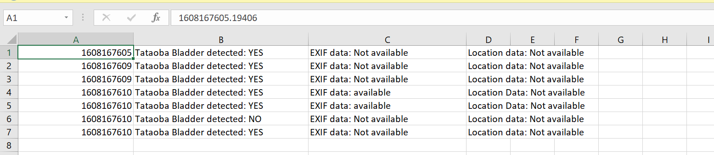

# vaquitahacks

To generate weights and architecture of the model run model notebook or download the json and H5 files here: https://drive.google.com/drive/folders/1brraphynm4dFQuds9w2zqLKYOS9EM_72?usp=sharing

Run the logfilegenerator script and input path of the folder that contains the images to be evaluated.

A log file in csv format will be generated in the following format: timestamp, Tataoba bladder detected: yes/no, EXIF data available: yes/no, Location data: yes/no

Here is how expected log file will look:

